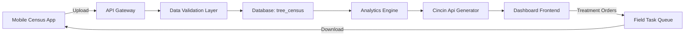

# CINCIN API DASHBOARD: ROADMAP UPDATE (MOBILE CENSUS INTEGRATION)

## 🚨 CRITICAL ADDITION: EPIC 0 - MOBILE GROUND CENSUS INTEGRATION

**Priority:** 🔴🔴🔴 **FOUNDATIONAL (Highest Priority)**  
**Status:** ⚠️ **MISSING - BLOCKS ALL OTHER FEATURES**  
**Estimated Effort:** 20 days  
**Cost:** $10,000

---

## REVISED PHASE POSITIONING

### **CURRENT DASHBOARD STATUS: FASE TRANSISI**

```
Phase 0: FOUNDATIONAL INFRASTRUCTURE (NOT STARTED) ← YOU ARE HERE
│  
├─ Epic 0.1: Mobile Census App Development
├─ Epic 0.2: Field-to-Dashboard Data Pipeline
├─ Epic 0.3: Cincin Api Regeneration Engine
│
Phase 1: PRODUCTION READINESS (BLOCKED)
│
├─ Epic 1.1: Multi-Division & Scalability (DEPENDS ON EPIC 0)
├─ Epic 1.2: Treatment Intelligence (DEPENDS ON EPIC 0.3)
│
Phase 2: ADVANCED ANALYTICS (FUTURE)
Phase 3: ENTERPRISE INTEGRATION (FUTURE)
```

**Diagnosis:**  
Dashboard saat ini adalah **"Analysis Shell"** tanpa **"Live Data Pipeline"**. Semua features existing (bar chart, treatment comparison, modal) adalah **visualization-ready** tapi **data-starved**.

---

## 📱 EPIC 0.1: MOBILE GROUND CENSUS APP

### **Purpose**
Field assistants menggunakan mobile app untuk sensus darat dan koreksi data pohon secara real-time, menggantikan manual paper-based atau Excel census.

### **Key Features**

#### **Feature 0.1.1: GPS-Based Tree Location Correction**
**Problem:** Manual census coordinates tidak akurat (off by 5-10 meters)  
**Solution:**
- Mobile app shows block map overlay
- Field assistant walks to infected tree (ancak pohon)
- Click "Correct Location" button
- App captures GPS coordinates (latitude, longitude)
- Submit → Update tree record in database

**Data Model:**
```javascript
tree_census_update = {
  tree_id: "D003A-R15-T23",  // Block-Row-Tree
  old_lat: -2.123456,
  old_lng: 101.234567,
  new_lat: -2.123789,        // GPS corrected
  new_lng: 101.234890,
  correction_date: "2026-01-15T09:15:00Z",
  surveyor: "Budi Santoso",
  photo_url: "s3://bucket/tree-D003A-R15-T23.jpg"
};
```

#### **Feature 0.1.2: Kenthosan (Fallen/Dead Palm) Marking**
**Problem:** Dead palms create "root contact gaps" that stop infection spread  
**Solution:**
- Field assistant finds fallen palm
- Tap "Mark as Kenthosan"
- Select reason:
  - ⚪ Natural death (age)
  - ⚪ Storm damage
  - ⚪ Ganoderma-infected (confirmed)
- Take photo → Submit

**Data Model:**
```javascript
kenthosan_record = {
  tree_id: "D003A-R15-T24",
  status: "fallen",
  reason: "ganoderma_confirmed",
  date_discovered: "2026-01-15",
  photo_url: "...",
  replacement_scheduled: false
};
```

**Impact on Analysis:**
- Kenthosan trees REMOVED from SPH calculation
- Gap in row = breaks root contact chain
- Dashboard recalculates "effective contact distance"

#### **Feature 0.1.3: Empty Spot / Missing Tree Marking**
**Problem:** Census records show 130 SPH but field only has 110 (20 missing)  
**Solution:**
- Field assistant walks grid
- If position expected but no tree → "Mark Empty Spot"
- Record:
  - GPS coordinates of empty spot
  - Reason (never planted / died early / stolen)
  - Historical data (was it ever there?)

**Data Model:**
```javascript
empty_spot = {
  position_id: "D003A-R15-T25",
  expected_location: { lat: -2.123, lng: 101.234 },
  status: "empty",
  reason: "early_death",
  last_seen: "2022-03-10",  // From historical census
  verified_by: "surveyor_id"
};
```

**Impact:**
- SPH CORRECTION: Real SPH = Census SPH - Empty Spots
- Dashboard flag "SPH Density Paradox" if gap >10%

#### **Feature 0.1.4: Tree Tilt/Lean Angle Recording**
**Problem:** Leaning trees indicate **root damage** (Ganoderma weakening)  
**Solution:**
- Mobile app uses phone accelerometer/gyroscope
- Hold phone against tree trunk
- App calculates tilt angle (0° = vertical, 45° = severe lean)
- Record direction of lean (N/S/E/W)

**Data Model:**
```javascript
tree_tilt = {
  tree_id: "D003A-R15-T26",
  tilt_angle: 32,  // degrees
  tilt_direction: "NE",
  measurement_date: "2026-01-15",
  severity: "moderate"  // <15° low, 15-30° moderate, >30° severe
};
```

**Analysis Logic:**
```javascript
if (tilt_angle > 30) {
  risk_score += 2;  // High probability root damage
  recommendation = "Priority inspection for Ganoderma";
}
```

#### **Feature 0.1.5: Offline-First Architecture**
**Problem:** Poor signal di remote estates  
**Solution:**
- Progressive Web App (PWA)
- Data saved locally dalam IndexedDB
- Sync to server when connection available
- Queue management for failed uploads

**Tech Stack:**
- **Frontend:** React Native atau Flutter (cross-platform iOS/Android)
- **Offline Storage:** SQLite or IndexedDB
- **Sync Protocol:** Background sync API
- **Map Library:** Mapbox GL (offline tile support)

---

## 🔄 EPIC 0.2: FIELD-TO-DASHBOARD DATA PIPELINE

### **Architecture: Bidirectional Data Flow**



### **API Contract**

#### **Endpoint 1: Upload Census Data**
```http
POST /api/census/upload
Authorization: Bearer {field_assistant_token}
Content-Type: multipart/form-data

{
  "block_code": "D003A",
  "survey_date": "2026-01-15",
  "surveyor_id": "FA123",
  "updates": [
    {
      "tree_id": "D003A-R15-T23",
      "type": "location_correction",
      "old_coords": {"lat": -2.123, "lng": 101.234},
      "new_coords": {"lat": -2.124, "lng": 101.235},
      "photo": <binary>
    },
    {
      "tree_id": "D003A-R16-T10",
      "type": "kenthosan",
      "status": "fallen",
      "reason": "ganoderma_confirmed"
    }
  ]
}

Response 200:
{
  "status": "success",
  "records_processed": 2,
  "analysis_queued": true,
  "eta_minutes": 5
}
```

#### **Endpoint 2: Download Treatment Tasks**
```http
GET /api/census/tasks?block_code=D003A
Authorization: Bearer {field_assistant_token}

Response 200:
{
  "block_code": "D003A",
  "tasks": [
    {
      "task_id": "T001",
      "type": "tree_removal",
      "tree_id": "D003A-R15-T23",
      "coordinates": {"lat": -2.124, "lng": 101.235},
      "protocol": "precision_sanitation",
      "priority": "critical",
      "deadline": "2026-01-20"
    },
    {
      "task_id": "T002",
      "type": "containment_trench",
      "center_coords": {"lat": -2.125, "lng": 101.236},
      "radius_meters": 15,
      "protocol": "ring_defense"
    }
  ]
}
```

### **Data Validation Rules**

**Rule 1: GPS Coordinate Sanity Check**
```python
def validate_gps(lat, lng, block_boundary):
    # Check coordinates within estate boundary
    if not is_point_in_polygon((lat, lng), block_boundary):
        raise ValidationError("GPS outside block boundary")
    
    # Check movement reasonable (<100m from old position)
    if distance(old_coords, new_coords) > 100:
        flag_for_manual_review()
```

**Rule 2: SPH Consistency Check**
```python
def validate_sph_update(block_code, census_data):
    current_sph = get_sph(block_code)
    new_sph = calculate_sph(census_data)
    
    delta_pct = abs(new_sph - current_sph) / current_sph
    
    if delta_pct > 0.15:  # >15% change triggers review
        alert_supervisor(f"SPH changed by {delta_pct*100}%")
```

**Rule 3: Photo Quality Check**
```python
def validate_photo(image_bytes):
    # Check file size (>100KB, <10MB)
    # Check EXIF GPS metadata matches submitted coords
    # Check timestamp within 24 hours
    # Run basic blur detection (reject unfocused images)
```

---

## 🎯 EPIC 0.3: CINCIN API REGENERATION ENGINE

### **Purpose**
Setiap kali mobile census upload data update, dashboard harus **re-analyze** untuk generate updated infection ring maps dan recalculate treatment coordinates.

### **Algorithm: "Cincin Api" (Infection Ring) Detection**

#### **Input Data:**
```javascript
const block_data = {
  trees: [
    { id: "D003A-R15-T23", lat: -2.124, lng: 101.235, infected: true },
    { id: "D003A-R15-T24", lat: -2.125, lng: 101.236, infected: false },
    { id: "D003A-R15-T25", lat: -2.126, lng: 101.237, kenthosan: true }
  ],
  sph_current: 108,
  planting_pattern: "triangular",  // affects root contact distance
  row_spacing: 9,  // meters
  tree_spacing: 9  // meters
};
```

#### **Step 1: Identify Infection Cores**
```python
def find_infection_cores(trees):
    """
    Cluster infected trees using DBSCAN algorithm
    - eps = 15 meters (root contact range)
    - min_samples = 3 (minimum cluster size)
    """
    from sklearn.cluster import DBSCAN
    
    infected_coords = [
        (tree.lat, tree.lng) 
        for tree in trees 
        if tree.infected and not tree.kenthosan
    ]
    
    clustering = DBSCAN(eps=15, min_samples=3).fit(infected_coords)
    
    cores = []
    for cluster_id in set(clustering.labels_):
        if cluster_id == -1:  # Noise (isolated trees)
            continue
        
        cluster_trees = [
            trees[i] for i in range(len(trees)) 
            if clustering.labels_[i] == cluster_id
        ]
        
        cores.append({
            'cluster_id': cluster_id,
            'tree_count': len(cluster_trees),
            'center': calculate_centroid(cluster_trees),
            'radius': calculate_bounding_radius(cluster_trees)
        })
    
    return cores
```

#### **Step 2: Generate Infection Rings**
```python
def generate_infection_rings(cores, trees):
    """
    For each core, create concentric rings:
    - Ring 1 (0-15m): Active infection zone (RED)
    - Ring 2 (15-30m): High-risk zone (ORANGE)
    - Ring 3 (30-50m): Monitoring zone (YELLOW)
    """
    rings = []
    
    for core in cores:
        ring_1 = {
            'core_id': core['cluster_id'],
            'center': core['center'],
            'radius_inner': 0,
            'radius_outer': 15,
            'risk_level': 'critical',
            'color': '#FF0000',
            'trees_in_ring': find_trees_in_radius(trees, core['center'], 15),
            'treatment': 'precision_sanitation'
        }
        
        ring_2 = {
            'core_id': core['cluster_id'],
            'center': core['center'],
            'radius_inner': 15,
            'radius_outer': 30,
            'risk_level': 'high',
            'color': '#FF8800',
            'trees_in_ring': find_trees_in_radius(trees, core['center'], 30, exclude_inner=15),
            'treatment': 'containment_trench'
        }
        
        ring_3 = {
            'core_id': core['cluster_id'],
            'center': core['center'],
            'radius_inner': 30,
            'radius_outer': 50,
            'risk_level': 'moderate',
            'color': '#FFCC00',
            'trees_in_ring': find_trees_in_radius(trees, core['center'], 50, exclude_inner=30),
            'treatment': 'intensive_monitoring'
        }
        
        rings.extend([ring_1, ring_2, ring_3])
    
    return rings
```

#### **Step 3: Consider Kenthosan Barriers**
```python
def adjust_rings_for_kenthosan(rings, kenthosan_trees):
    """
    Kenthosan creates natural barriers that disrupt root contact
    If ring crosses kenthosan line, truncate propagation path
    """
    for ring in rings:
        for kenthosan in kenthosan_trees:
            distance = haversine(ring['center'], kenthosan.coords)
            
            if distance < ring['radius_outer']:
                # Kenthosan inside ring - creates safety zone behind it
                ring['effective_radius'] = min(
                    ring['radius_outer'],
                    distance - 9  # Tree spacing as buffer
                )
                ring['notes'] = f"Truncated by kenthosan at {kenthosan.id}"
    
    return rings
```

#### **Step 4: Generate Treatment Prescription**
```python
def generate_treatment_prescription(rings):
    """
    Convert rings to actionable field tasks
    """
    tasks = []
    
    for ring in rings:
        if ring['risk_level'] == 'critical':
            # Ring 1: Remove ALL infected trees
            for tree in ring['trees_in_ring']:
                if tree.infected:
                    tasks.append({
                        'type': 'tree_removal',
                        'tree_id': tree.id,
                        'coords': (tree.lat, tree.lng),
                        'protocol': 'precision_sanitation',
                        'priority': 1,
                        'cost_estimate': 2.5  # million IDR per tree
                    })
        
        elif ring['risk_level'] == 'high':
            # Ring 2: Containment trench
            tasks.append({
                'type': 'containment_trench',
                'ring_id': ring['id'],
                'center': ring['center'],
                'radius': ring['radius_outer'],
                'depth': 1.5,  # meters
                'width': 0.5,   # meters
                'protocol': 'ring_defense',
                'priority': 2,
                'cost_estimate': 150  # million IDR per ring
            })
        
        else:
            # Ring 3: Monthly visual census + NDRE scan
            tasks.append({
                'type': 'monitoring',
                'ring_id': ring['id'],
                'frequency': 'monthly',
                'protocol': 'yellow_leaf_watch',
                'priority': 3,
                'cost_estimate': 5  # million IDR per month
            })
    
    return tasks
```

### **Output to Dashboard**

**Updated Data Structure:**
```javascript
const regenerated_data = {
  block_code: "D003A",
  analysis_timestamp: "2026-01-15T09:30:00Z",
  
  // Updated metrics after census
  sph_actual: 105,  // Down from 108 (3 kenthosan found)
  sph_census: 130,  // Original census SPH
  sph_gap: 25,      // 25 trees missing/dead
  
  infected_count: 22,
  kenthosan_count: 3,
  
  // Cincin Api rings
  infection_rings: [
    {
      ring_id: "R1-CORE-01",
      risk_level: "critical",
      center: { lat: -2.124, lng: 101.235 },
      radius: 15,
      trees_affected: 8,
      treatment_cost: 20  // million IDR
    }
  ],
  
  // Treatment tasks untuk mobile app
  field_tasks: [
    {
      task_id: "T001",
      type: "tree_removal",
      tree_id: "D003A-R15-T23",
      row: 15,
      tree_number: 23,
      gps: { lat: -2.124, lng: 101.235 },
      deadline: "2026-01-20"
    }
  ],
  
  // Financial recalculation
  financial_impact: {
    current_loss: 176.8,  // million IDR
    projected_3yr: 540,
    treatment_cost: 170,  // total tasks cost
    roi: 218  // (540 * 0.7 - 170) / 170 * 100
  }
};
```

---

## 🗺️ DASHBOARD INTEGRATION POINTS

### **UI Changes Required**

#### **Change 1: Add "Data Freshness" Indicator**
```html
<div class="bg-blue-900/30 p-3 rounded-lg border border-blue-500/30 mb-4">
  <div class="flex items-center justify-between">
    <div>
      <span class="text-blue-300 text-xs font-bold">Last Census Update:</span>
      <span class="text-white text-sm ml-2">2026-01-15 09:30</span>
    </div>
    <div>
      <span class="text-emerald-400 text-xs">✓ Data Fresh</span>
    </div>
  </div>
</div>
```

#### **Change 2: Show SPH Correction History**
```javascript
// In ESTIMASI panel, add audit trail
const sph_audit = {
  current: 105,
  census: 130,
  corrections: [
    { date: "2026-01-15", type: "kenthosan", delta: -3 },
    { date: "2026-01-10", type: "location_fix", delta: 0 },
    { date: "2025-12-20", type: "empty_spot", delta: -22 }
  ]
};
```

#### **Change 3: Cincin Api Map Layer (NEW FEATURE)**
```html
<!-- Add interactive map to dashboard -->
<div class="p-6 bg-slate-900 rounded-xl">
  <h3 class="text-white font-bold mb-4">Peta Cincin Api - Block D003A</h3>
  <div id="cincinApiMap" style="height: 500px;">
    <!-- Mapbox GL rendering:
         - Block boundary (polygon)
         - Trees (dots: green=healthy, red=infected, gray=kenthosan)
         - Infection rings (concentric circles with opacity)
         - Treatment tasks (markers with priority color)
    -->
  </div>
  
  <!-- Legend -->
  <div class="mt-4 flex gap-4">
    <div class="flex items-center gap-2">
      <div class="w-4 h-4 bg-red-500 rounded-full"></div>
      <span class="text-xs text-white">Ring 1 (0-15m) - Removal</span>
    </div>
    <div class="flex items-center gap-2">
      <div class="w-4 h-4 bg-orange-500 rounded-full"></div>
      <span class="text-xs text-white">Ring 2 (15-30m) - Trench</span>
    </div>
    <div class="flex items-center gap-2">
      <div class="w-4 h-4 bg-yellow-500 rounded-full"></div>
      <span class="text-xs text-white">Ring 3 (30-50m) - Monitor</span>
    </div>
  </div>
</div>
```

#### **Change 4: Field Task Queue Panel**
```html
<div class="bg-indigo-900/30 p-6 rounded-xl border border-indigo-500/30">
  <h3 class="text-white font-bold mb-4">📋 Pending Field Tasks</h3>
  
  <div class="space-y-3">
    <div class="bg-slate-800 p-3 rounded-lg border-l-4 border-red-500">
      <div class="flex justify-between">
        <span class="text-white font-bold">Tree Removal</span>
        <span class="text-red-400 text-xs">CRITICAL</span>
      </div>
      <div class="text-slate-400 text-sm mt-1">
        Block D003A, Row 15, Tree 23
      </div>
      <div class="text-slate-500 text-xs mt-1">
        Deadline: 2026-01-20 | Assigned: Budi S.
      </div>
    </div>
    
    <!-- More tasks... -->
  </div>
  
  <button class="mt-4 w-full bg-indigo-600 text-white py-2 rounded-lg">
    Export to Mobile App
  </button>
</div>
```

---

## 📊 UPDATED IMPLEMENTATION TIMELINE

### **REVISED ROADMAP SEQUENCE**

```
PHASE 0: FOUNDATIONAL (20 days) ← START HERE
├─ Week 1-2: Mobile Census App MVP
│  ├─ GPS correction UI
│  ├─ Kenthosan marking
│  ├─ Photo upload
│  └─ Offline storage
│
├─ Week 3: API & Data Pipeline
│  ├─ Upload/download endpoints
│  ├─ Data validation layer
│  └─ Database schema
│
└─ Week 4: Cincin Api Engine + Dashboard Integration
   ├─ Ring generation algorithm
   ├─ Map visualization
   └─ Task queue system

PHASE 1: PRODUCTION READINESS (15 days)
├─ Multi-division support
├─ Treatment protocol library
└─ Executive PDF reports

PHASE 2: ADVANCED ANALYTICS (60 days)
└─ ML predictions, anomaly detection

PHASE 3: ENTERPRISE (90 days)
└─ ERP integration, compliance
```

### **Budget Update**

| Phase | Original | Updated | Delta |
|-------|----------|---------|-------|
| **Phase 0** | $0 | **$10,000** | +$10,000 |
| **Phase 1** | $22,500 | $22,500 | $0 |
| **TOTAL** | $22,500 | **$32,500** | +44% |

**Justification:** Mobile app development + API backend + cincin api algorithm adalah foundational infrastructure yang tidak bisa dihindari.

---

## ✅ DELIVERABLES (PHASE 0)

### **Mobile Census App**
- [ ] React Native app (iOS + Android)
- [ ] Offline-first architecture
- [ ] GPS location correction
- [ ] Kenthosan marking dengan photo
- [ ] Empty spot recording
- [ ] Tree tilt measurement
- [ ] Sync dengan dashboard API

### **API Backend**
- [ ] `/api/census/upload` endpoint
- [ ] `/api/census/tasks` endpoint
- [ ] Data validation pipeline
- [ ] Photo storage (S3/GCS)
- [ ] Queue system untuk async processing

### **Cincin Api Engine**
- [ ] DBSCAN clustering algorithm
- [ ] Ring generation (3 levels)
- [ ] Kenthosan barrier logic
- [ ] Treatment prescription generator
- [ ] GeoJSON output untuk maps

### **Dashboard Updates**
- [ ] Cincin Api map layer (Mapbox GL)
- [ ] Field task queue panel
- [ ] SPH audit trail
- [ ] Data freshness indicator
- [ ] Re-analysis trigger button

---

## 🎯 SUCCESS CRITERIA (PHASE 0)

1. **Mobile App:**
   - ✅ Field assistant dapat census 50 pohon dalam 1 jam
   - ✅ Photo upload success rate >95%
   - ✅ Offline mode works for 8 hours
   - ✅ GPS accuracy <5 meters

2. **Data Pipeline:**
   - ✅ Census upload processing <30 seconds
   - ✅ Zero data loss during sync
   - ✅ Validation catches >90% of errors

3. **Cincin Api Accuracy:**
   - ✅ Ring generation completes <2 minutes per block
   - ✅ Treatment tasks match expert agronomist recommendations >80%
   - ✅ Cost estimates within ±20% of actual

4. **Dashboard Integration:**
   - ✅ Map loads <3 seconds
   - ✅ Real-time updates visible within 5 minutes of census upload
   - ✅ Task queue exports to mobile app successfully

---

## 🚀 IMMEDIATE NEXT STEPS (Week 1)

### **Day 1-2: Requirements Finalization**
- [ ] Workshop dengan field team untuk validate mobile app UX
- [ ] Define ALL data fields untuk census (beyond 4 features listed)
- [ ] Confirm planting pattern (triangular? square?)
- [ ] Get sample GPS boundary data untuk 1 test block

### **Day 3-5: Technical Spec**
- [ ] API contract documentation (Swagger)
- [ ] Database schema design (ERD)
- [ ] Mobile app wireframes (Figma)
- [ ] Cincin api algorithm pseudocode review

### **Day 6-10: Development Kickoff**
- [ ] Setup development environment
- [ ] Mobile app Hello World
- [ ] API scaffold (FastAPI or NestJS)
- [ ] Database migration scripts

---

**Document Status:** 🚨 **CRITICAL UPDATE REQUIRED**  
**Next Review:** After Phase 0 requirements workshop (Week 1)  
**Owner:** Product Team + Field Operations

---

> **CRITICAL NOTE:**  
> Dashboard features seperti treatment comparison modal, degradation charts, dll are **"Analysis Ready"** tapi **"Data Starved"**. EPIC 0 adalah **unblocking requirement** untuk semua future enhancements. Tanpa mobile census integration, dashboard hanya visualization shell tanpa live operational value.
